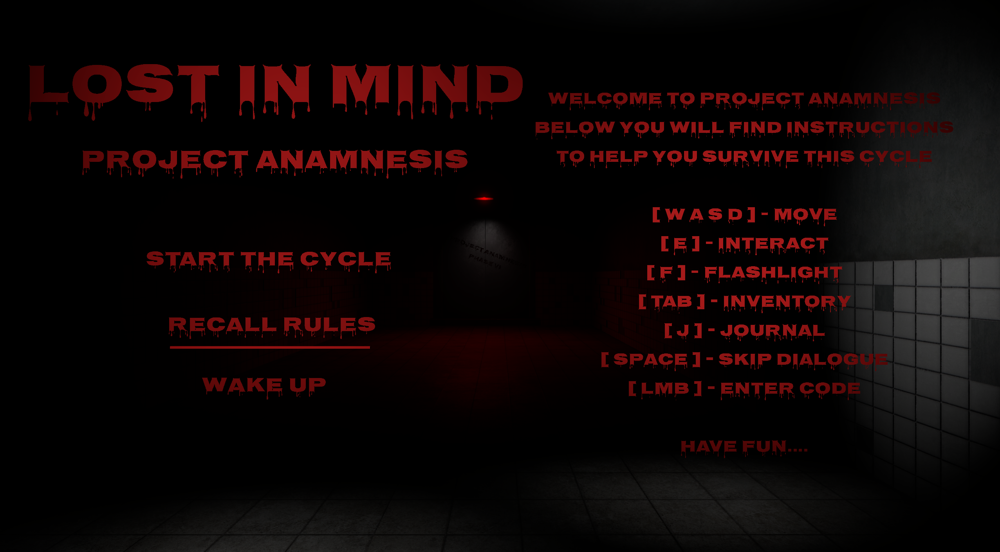
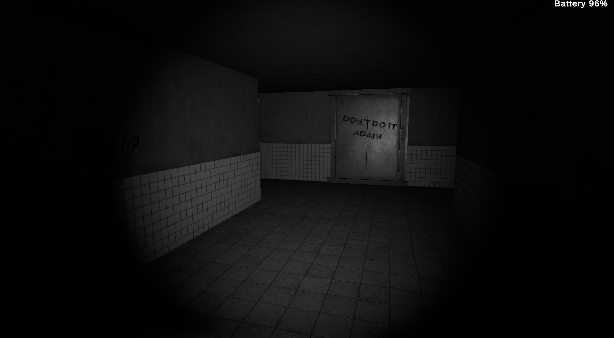
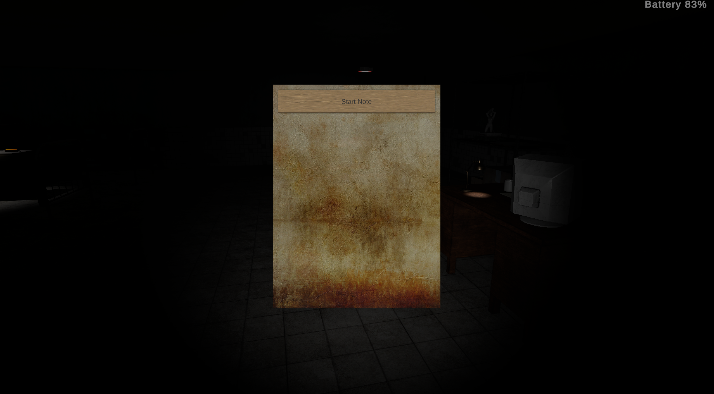
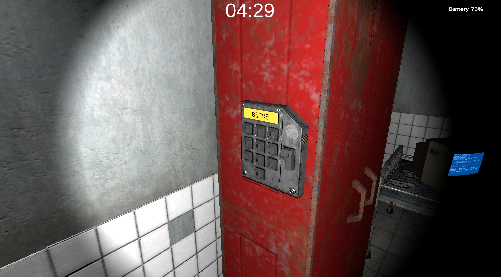

# Lost in Mind: Project Anamnesis

**Lost in Mind: Project Anamnesis** is an atmospheric first-person (FPP) psychological horror / escape room game developed in the **Unity** engine. Players step into the shoes of a character trying to recover their lost memories and escape a dark, abandoned medical facility, while confronting their own subconscious and the chilling remnants of the past.

---

## 🎮 Playable Build
The compiled, ready-to-play Windows version of the game (containing the `.exe` file along with all required libraries and dependencies) has been published on itch.io:
👉 **[https://rauhvin.itch.io/lost-in-mind-project-anamnesis]**

---

## 📸 Screenshots

  

  

  

  

---

## 🛠️ Core Mechanics & Features (C#)
The project is written entirely in C#, focusing on tension-building, atmosphere, and environmental interactions:

* **Advanced Journal UI System:** A dynamic note and document system with a custom visual layout, allowing the player to track the lore, storyline, and medical records.
* **Exploration & Flashlight Mechanics:** A battery power management system implemented to enhance the horror atmosphere and restrict player visibility.
* **Keypad Systems & Puzzles:** An interactive keypad system and various puzzle objects requiring player input and investigation to unlock new sections of the facility.
* **Ending Logic & Game State Management:** A time-dependent system featuring two distinct endings based on the player's completion time.

---

## 📁 Project Structure (Where is the code?)
All custom gameplay logic and scripts are located in the dedicated directory:
📂 `Assets/Scripts/`

---

## 🔄 Version Control
The primary and native version control system utilized by us during the active production and development phase within the Unity engine was **Unity Version Control**. 

---

## 🚀 Technologies & Tools
* **Game Engine:** Unity
* **Scripting Language:** C#
* **UI Text Rendering:** TextMeshPro
* **Native Project Version Control:** Unity Version Control
* **Code Presentation Platform:** GitHub
